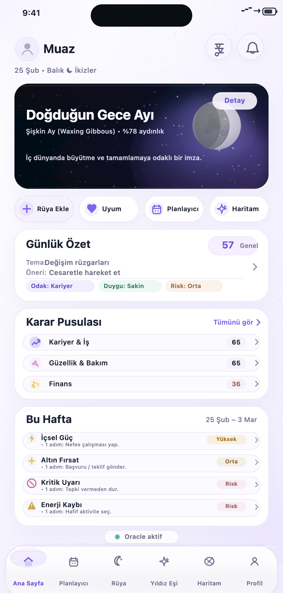
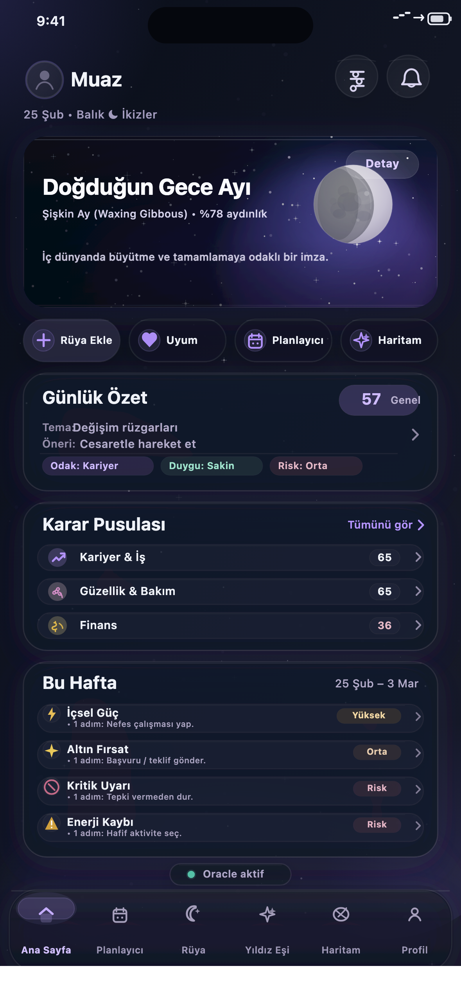

# Home V2 Mockup ve Entegrasyon Planı

Bu klasör, yeni iOS ana sayfa tasarımının (Light + Dark) referans görsellerini ve `mysticai-mobile` uygulamasına entegrasyon planını içerir.

Not: Bu doküman şu aşamada **tasarım + entegrasyon planı** içindir. Uygulama koduna entegrasyon ayrı bir implementasyon adımıdır.

## Teslim Edilen Görseller

### Home — Light (V2)

### Home — Dark (V2)

## Dosyalar

- `home-light-v2.png` (tam ekran, 1179x2556 PNG)
- `home-dark-v2.png` (tam ekran, 1179x2556 PNG)
- `home-light-v2.svg` (vektörel kaynak)
- `home-dark-v2.svg` (vektörel kaynak)

## Mevcut Uygulama Durumu (Kod Bazlı Gözlem)

Aşağıdaki mevcut dosyalar entegrasyon için kritik:

- `src/app/(tabs)/home.tsx`
  - Halihazırda ana sayfa screen'i.
  - `useHomeBrief`, `useSkyPulse`, `useCosmicSummary` query'lerini kullanıyor.
  - `useAuthStore`, `useOnboardingStore`, `useTheme`, `useTranslation` aktif.
- `src/hooks/useHomeQueries.ts`
  - Home ekranı için react-query hook'ları hazır.
  - `useHomeBrief`, `useSkyPulse`, `useCosmicSummary` direkt kullanılabilir.
- `src/services/oracle.service.ts`
  - `HomeBrief` tipi mevcut (`weeklyCards`, `transitHeadline`, `meta.impactScore`, vb.).
- `src/services/astrology.service.ts`
  - `SkyPulseResponse` tipi mevcut (`moonPhase`, `moonSignTurkish`, `date`).
  - `DailyLifeGuideResponse` tipi mevcut (`overallScore`, `groups`, `activities`).
- `src/app/(tabs)/_layout.tsx`
  - 6 görünür tab zaten mevcut: `home`, `calendar`, `dreams`, `star-mate`, `natal-chart`, `profile`.

Sonuç: Home V2 için gereken veri altyapısının önemli kısmı zaten mevcut. Entegrasyon ağırlıklı olarak **UI kompozisyon + veri mapping + stil uyarlaması** işi olacaktır.

## Home V2 Entegrasyon Hedefi

Hedef, mevcut ana sayfayı tamamen kırmadan aşağıdaki yaklaşım ile yeni tasarıma geçirmek:

1. Mevcut query/store katmanını koru.
2. UI katmanını `HomeV2` bileşenlerine ayır.
3. Önce statik layout + canlı veri binding yap.
4. Sonra polish (blur, motion, skeleton, accessibility) ekle.

## Önerilen Entegrasyon Stratejisi (Düşük Risk)

### Aşama 1: `home.tsx` içinde V2 render path'i aç

- `src/app/(tabs)/home.tsx` içinde feature flag/toggle eklenir.
- Örnek yaklaşımlar:
  - geçici local sabit: `const HOME_V2_ENABLED = true`
  - remote config / env (daha sonra)
- Eski ekran fallback olarak korunur.

### Aşama 2: View-model mapper katmanı ekle

Yeni UI doğrudan raw API response kullanmasın. Bunun yerine tek bir mapper kullanılmalı.

Önerilen yeni dosya:

- `src/components/HomeV2/homeV2Mapper.ts`

Amaç:

- `user + skyPulse + homeBrief + dailyLifeGuide + theme/i18n` verisini tek bir `HomeV2Model`'e dönüştürmek
- fallback metinleri merkezi yönetmek
- UI bileşenlerini sade tutmak

### Aşama 3: Home V2 bileşenlerini modüler kur

Önerilen klasör:

- `src/components/HomeV2/`

Önerilen bileşenler:

- `HomeV2Screen.tsx` (kompozisyon)
- `HomeV2TopBar.tsx`
- `HomeV2MoonHeroCard.tsx`
- `HomeV2QuickActions.tsx`
- `HomeV2DailySummaryCard.tsx`
- `HomeV2DecisionCompassPreview.tsx`
- `HomeV2WeeklyAccordion.tsx`
- `HomeV2OracleStatusPill.tsx`
- `homeV2Styles.ts` veya token tabanlı stil helper
- `homeV2.types.ts`

### Aşama 4: Tab bar'ı mockup'a yaklaştır

Gerçek iOS blur/tabbar hissi için iki seçenek:

- Kısa yol: `src/app/(tabs)/_layout.tsx` içindeki `tabBarStyle` ve renkleri iyileştir.
- Premium yol: `tabBarBackground` + `expo-blur` veya custom tab bar wrapper kullan.

Öneri: İlk iterasyonda mevcut `Tabs` yapısını koruyup stil iyileştirmesi yapın.

## Mockup Bölümleri -> Mevcut Veri Mapping Planı

### 1) Top Bar

Mockup içeriği:

- Avatar + kullanıcı adı (`Muaz` örneği)
- İki ikon buton (ayar/filtre, bildirim)
- Alt satır: `25 Şub • Balık ☾ İkizler`

Veri kaynağı:

- Kullanıcı adı: `useAuthStore((s) => s.user)`
- Güneş burcu: `user.zodiacSign`
- Ay burcu: `useSkyPulse().data?.moonSignTurkish`
- Tarih: `skyPulse.date` (locale = `tr`) veya client-side `new Date()` fallback

Not:

- `SkyPulseResponse` içinde `moonSignSymbol` var, bu üst satırda kullanılabilir.
- Bildirim butonu için route hazır değilse placeholder action ile başlayın.

### 2) Hero Kart — “Doğduğun Gece Ayı”

Mockup içeriği:

- Moon hero görseli
- Başlık + alt satır + kısa yorum
- `Detay` CTA

Veri kaynağı (V1):

- Faz etiketi: `skyPulse.moonPhase`
- Yorum/fallback metni: `homeBrief.dailyEnergy` veya `homeBrief.transitSummary`
- CTA action: `router.push('/night-sky-poster-preview')` veya detay modal

Veri açığı (V2 polish):

- Mockup'taki `Waxing Gibbous • %78 aydınlık` gibi detaylar mevcut `SkyPulseResponse` içinde tam yok.
- Bu veri için opsiyonlar:
  - `NightSkyProjectionResponse.moonPhase` kullan (aydınlık % + faz label)
  - veya backend `skyPulse` cevabını genişlet (önerilen)

Öneri:

- İlk sürümde `moonPhase` string + fallback metin ile çıkın.
- Sonraki sprintte `illuminationPercent` ekleyin.

### 3) Quick Actions

Mockup butonları:

- Rüya Ekle
- Uyum
- Planlayıcı
- Haritam

Önerilen route mapping:

- `Rüya Ekle` -> `router.push('/(tabs)/dreams')` veya `router.push('/dreams')`
- `Uyum` -> `router.push('/(tabs)/star-mate')` veya `router.push('/(tabs)/compatibility')`
- `Planlayıcı` -> `router.push('/(tabs)/calendar')`
- `Haritam` -> `router.push('/(tabs)/natal-chart')`

Not:

- `compatibility` tabı `_layout.tsx` içinde hidden (`tabBarButton: () => null`). Quick action için iyi aday.

### 4) Günlük Özet Kartı

Mockup içeriği:

- Başlık
- Skor çipi (`57 Genel`)
- 2 satır tema/öneri
- 3 chip (Odak / Duygu / Risk)

Önerilen veri kaynağı:

- Skor: `useCosmicSummary().data?.overallScore`
- Tema: `homeBrief.transitHeadline` veya `skyPulse.dailyVibe`
- Öneri: `homeBrief.actionMessage`
- Chip'ler:
  - `Odak`: kullanıcı focus point (`user.focusPoint` veya onboarding fallback)
  - `Duygu`: `homeBrief.transitSummary`'dan türetilmiş kısa label (mapper ile normalize)
  - `Risk`: `homeBrief.meta.impactScore` veya activity tone dağılımından türetilmiş seviye

Not:

- `DailyLifeGuideResponse` içinde `overallScore` hazır olduğu için skor çipi net bağlanabilir.

### 5) Karar Pusulası (Top 3 Preview)

Mockup içeriği:

- Top 3 kategori satırı + skor + chevron

Önerilen veri kaynağı:

- `useCosmicSummary().data?.activities`
- Filtre: `useDecisionCompassStore().hiddenActivityKeys`
- Sıralama: skor desc
- İlk 3 gösterim

Mapper görevi:

- `activityLabel`, `score`, `icon`, `statusLabel` alanlarını preview modeline dönüştürmek
- UI ikon setini `activity.groupKey` / `activity.activityKey` üzerinden eşlemek

### 6) Bu Hafta (Accordion Preview)

Mockup içeriği:

- 4 satır: İçsel Güç / Altın Fırsat / Kritik Uyarı / Enerji Kaybı
- Badge (`Yüksek`, `Orta`, `Risk`)
- 1 kısa bullet öneri

Önerilen veri kaynağı:

- `homeBrief.weeklyCards[]`

Mapping önerisi:

- `strength` -> `İçsel Güç`
- `opportunity` -> `Altın Fırsat`
- `threat` -> `Kritik Uyarı`
- `weakness` -> `Enerji Kaybı`

Badge türetme:

- `strength` -> `Yüksek`
- `opportunity` -> `Orta`
- `threat` / `weakness` -> `Risk`

Satır altı kısa öneri:

- `weeklyCards[i].quickTip`
- kısa kesme gerekiyorsa mapper seviyesinde 1 satıra normalize edin

### 7) Footer Durum — “Oracle aktif”

Önerilen veri kaynağı:

- Mevcut `ServiceStatus` bileşeninden state reuse
- veya `checkOracleHealth()` ile lightweight health ping

Öneri:

- İlk sürümde mevcut `ServiceStatus` bilgisini sade bir pill'e map edin.
- Ayrı health request ile home render'ını bloklamayın.

### 8) Bottom Tab Bar

Mevcut durum:

- `src/app/(tabs)/_layout.tsx` içinde Expo Router `Tabs` kullanılıyor.

Mockup hedefi:

- iOS blur/translucent tabbar
- 6 sekme (zaten mevcut)
- aktif sekmede vurgu + capsule hissi

İlk iterasyon önerisi:

- `tabBarStyle` renklerini ve border/shadow'u güncelle
- `tabBarActiveTintColor`, `tabBarInactiveTintColor` iyileştir
- `TYPOGRAPHY.CaptionSmall` yerine daha kompakt label varyantı test et

İkinci iterasyon (opsiyonel):

- `tabBarBackground` ile blur surface
- iOS için daha güçlü glass + highlight

## Önerilen Dosya Planı (Implementasyon Sırasında)

Aşağıdaki dosyalar eklenecek/değişecek (öneri):

### Yeni dosyalar

- `src/components/HomeV2/homeV2.types.ts`
- `src/components/HomeV2/homeV2Mapper.ts`
- `src/components/HomeV2/HomeV2Screen.tsx`
- `src/components/HomeV2/HomeV2TopBar.tsx`
- `src/components/HomeV2/HomeV2MoonHeroCard.tsx`
- `src/components/HomeV2/HomeV2QuickActions.tsx`
- `src/components/HomeV2/HomeV2DailySummaryCard.tsx`
- `src/components/HomeV2/HomeV2DecisionCompassPreview.tsx`
- `src/components/HomeV2/HomeV2WeeklyAccordion.tsx`
- `src/components/HomeV2/HomeV2OracleStatusPill.tsx`
- `src/components/HomeV2/index.ts`

### Güncellenecek dosyalar

- `src/app/(tabs)/home.tsx` (feature flag + V2 render entegrasyonu)
- `src/app/(tabs)/_layout.tsx` (tab bar stil iyileştirme)
- `src/i18n/tr.json` (V2 metin key'leri eklenirse)
- `src/i18n/en.json` (opsiyonel, TR sonrası)

## Sprint Bazlı Uygulama Planı

### Sprint 1 (1-2 gün) — Statik V2 + canlı veri binding

Hedef:

- Home V2 layout'u component bazlı kurulsun
- Mevcut query'ler bağlansın
- Light/Dark tema çalışsın
- Eski home fallback kalsın

Çıktı:

- `home.tsx` içinde V2 toggle
- `HomeV2Screen` + temel alt bileşenler
- veri mapping (minimum fallback ile)

### Sprint 2 (1 gün) — Polish + tab bar uyumu

Hedef:

- Tab bar blur/translucent hissi iyileştirilsin
- spacing/typography fine-tune
- empty/loading/error state görünümü iyileştirilsin

Çıktı:

- skeleton/loading placeholders
- dark theme kontrast kontrolü
- tabbar style refine

### Sprint 3 (0.5-1 gün) — Veri zenginleştirme (Moon details)

Hedef:

- Hero alt satırı mockup'a daha yakın hale gelsin (`illumination %`, moon phase label)

Çıktı seçenekleri:

- `SkyPulseResponse` genişletme (önerilen)
- veya `NightSkyProjectionResponse.moonPhase` reuse (cache'li)

## Kabul Kriterleri (Definition of Done)

- Home ekranı light/dark temada taşma/crop olmadan çalışır.
- Safe area ve iOS üst alan spacing'i doğru görünür.
- 4 quick action butonu route'lara gider.
- Günlük Özet skoru canlı veriden gelir (fallback destekli).
- Karar Pusulası Top 3 listesi canlı veriden gelir.
- Bu Hafta kartı `weeklyCards` verisi yoksa fallback/placeholder gösterir.
- Tab bar aktif/inaktif renkleri mockup'a yakın görünür.
- `onRefresh` mevcut davranışı korunur.
- Accessibility: dokunma alanları >= 44px, metin kontrastı kabul edilebilir.

## Riskler / Teknik Notlar

- Mockup'taki moon illumination (`%78`) için backend veri genişletmesi gerekebilir.
- Tab bar'ın birebir iOS blur görünümü Expo `Tabs` default ile sınırlı olabilir.
- `DailyLifeGuideResponse.activities` ikon mapping'i için ek bir `iconMap` tablosu gerekebilir.
- TR metinler uzun olduğunda chip/row truncation kuralları net tanımlanmalı.

## Hızlı Başlangıç (Implementasyona Geçerken)

Önerilen ilk adım sırası:

1. `src/components/HomeV2` klasörünü oluştur.
2. `homeV2Mapper.ts` ile tek model üret.
3. `HomeV2Screen.tsx` içinde mockup layout'u kur.
4. `src/app/(tabs)/home.tsx` içinde feature flag ile bağla.
5. `_layout.tsx` tabbar stilini mockup yönünde güncelle.
6. iPhone simulator/screenshots ile light/dark görsel karşılaştırma yap.

## Kaynak

Bu klasördeki görseller, `design-mockups/` altında üretilen SVG/PNG mockup çıktılarından kopyalanmıştır.

